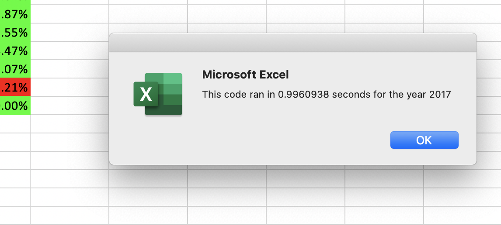
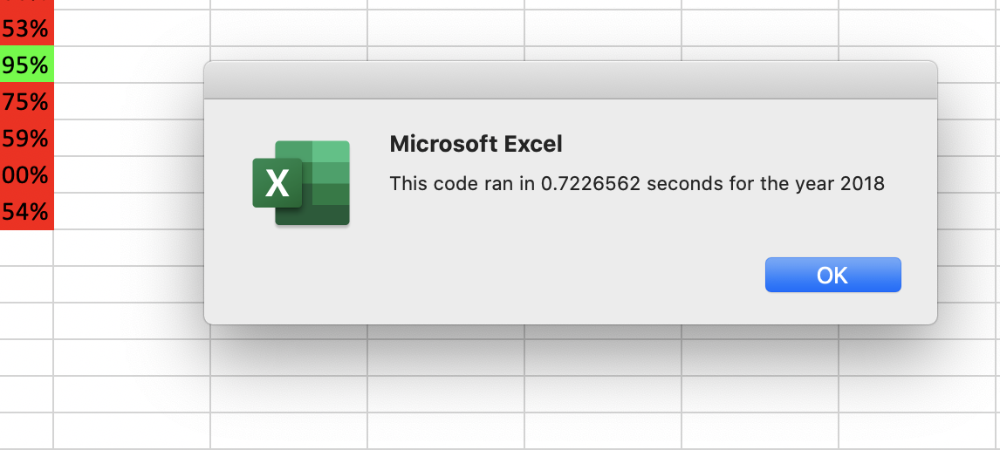
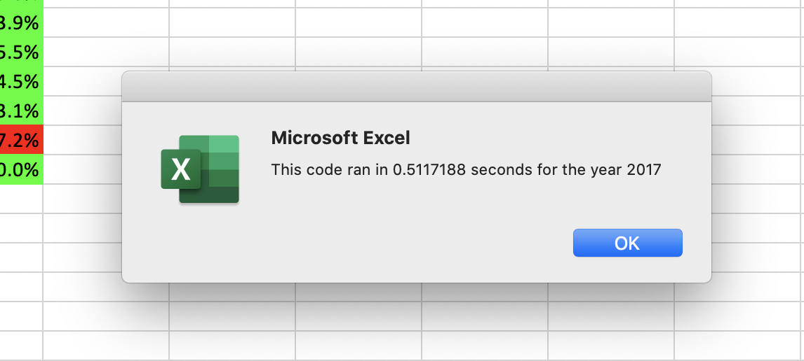
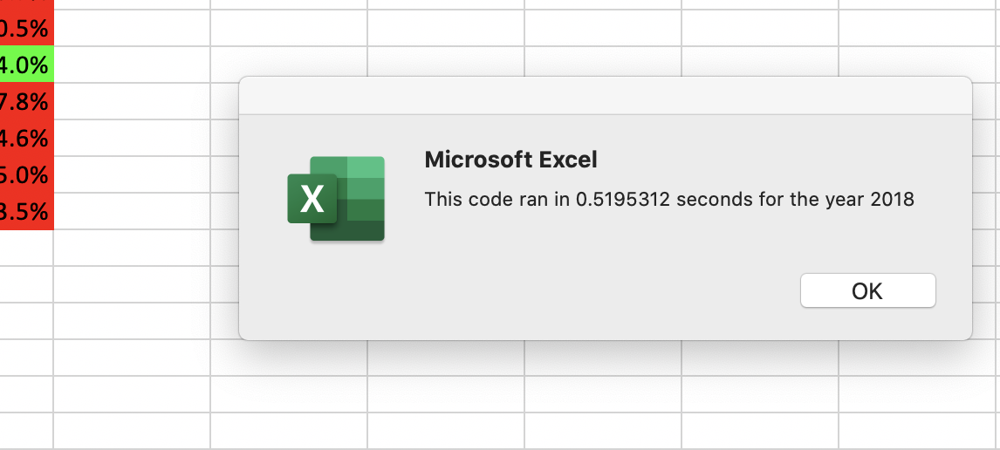

# Stocks Analysis
Stock Analysis with VBA - Module 2

## Overview:

The purpose of the code we prepared during this module - and the code we worked with in this challenge - was to automate an analysis of the performance of various stocks (volume and annual return) for a given year, with the starting data provided. "Our friend Steve" (who really should be paying us for this work), wants to be able to provide his parents with the best information possible on an assortment of "green industry" stocks.

The primary purpose of this end-of-module challenge is to edit or refactor the module's code to make it more efficient, and perhaps more easily understandable. The values we always wish to emulate are that simple, well-documented, and efficient code is the best code. This sacred truth comes second only to the truth that [Hexagons are the Bestagons](https://youtu.be/thOifuHs6eY).

## Results:

The output of the end-of-lesson code and the refactored code are essentially the same - as it should be. An analysis of daily trading volumes and annual returns for the selected "green companies" showed that in 2017:
- the ticker with the highest trading volume was SunPower (SPWR);
- the ticker with the best rate of return was Daqo New Energy (DQ);
- most of the stocks performed well, with only two having negative returns.

Meanwhile in 2018:
- the ticker with the highest trading volume was Enphase (ENPH);
- the ticker with the best rate of return was SunRun (RUN);
- most of the stocks preformed poorly, with only two having positive returns.

While I'm sure "Steve and his parents" will be very happy to receive this data (even though it's two years old), what should be of interest to us is how well the VBA module preformed and why.


As you can see from the above images, when we ran the post-lesson/pre-refactoring module on the 2017 and 2018 lists of stocks (with just over 3000 rows of data in each) the processes took almost 1 second to 3/4 of a second for each, respectively. This may not seem like a lot of time, but if we had a sheet with 50,000 rows, or more, this processing time would be significantly multiplied. In this time the subroutine ran through the list of ticker symbols and stock activity, checking it for price and volume data for each ticker in our listed array, before outputting it's findings, then running through the data again and doing the same for the next ticker in the array. But we can and did do better.


Now we've knocked processing time for both the 2017 and 2018 data down to half-a-second each. We achieved this primarily through two changes. First we changed our three primary variables into arrays:
```
 Dim tickerVolumes(12) As Long
 Dim tickerStartPrices(12) As Single
 Dim tickerEndPrices(12) As Single
```
This, in turn, allows us to store more data in memory, which allowed us to move our output process into it's own for-loop:
```
Worksheets("All Stocks Analysis").Activate
Cells(4 + i, 1).Value = tickers(i)
Cells(4 + i, 2).Value = tickerVolumes(i)
Cells(4 + i, 3).Value = tickerEndPrices(i) / tickerStartPrices(i) - 1
```
Prior to this our `tickerVolume`, `tickerStartPrice`, and `tickerEndPrice` *(note the singular instead of plural used with the array declarations)* were simple variables that would be overwritten with each new round of the for-loop, so therefore had to output its value while it still had it. This meant that the module had to switch back-and-forth between the data and output worksheets repeatedly with `Worksheets("...").Activate`. This is likely where most of the processing time was taken up. Though this change looked less compact from the outset, it was in-fact, enabling a better use of memory and processing resources.

## Summary:
/Summary: In a summary statement, address the following questions.
What are the advantages or disadvantages of refactoring code?
How do these pros and cons apply to refactoring the original VBA script?


